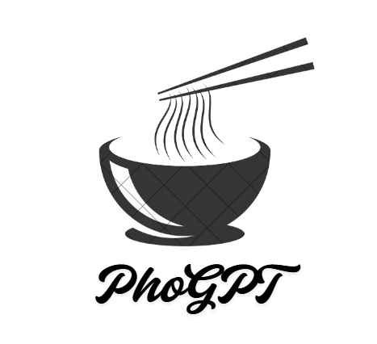

# 🤖 PhoGPT – Trợ lý AI Gemini trên Streamlit

PhoGPT là một ứng dụng trò chuyện AI xây dựng bằng Python và Streamlit, sử dụng mô hình **Google Gemini** để tạo hội thoại tự nhiên. Giao diện đẹp, dễ tùy biến, hỗ trợ phản hồi bằng giọng nói và hình ảnh.

---

## 🚀 Tính năng

- 💬 Trò chuyện thông minh với mô hình Gemini 1.5
- 🎨 Giao diện đẹp, có avatar, hiệu ứng typing, dark mode
- 🔊 Phản hồi có âm thanh
- 🖼️ Tự động hiển thị ảnh nếu có liên kết hình ảnh trong câu trả lời
- ⚙️ Dễ dàng cấu hình, hỗ trợ `secrets.toml` và `.env`

---

## 🧪 Demo



---

## 🛠️ Cài đặt

```bash
git clone https://github.com/your-username/phogpt.git
cd phogpt
pip install -r requirements.txt